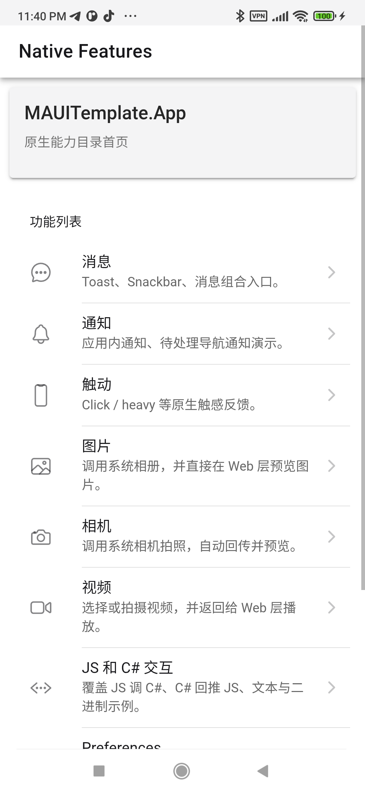
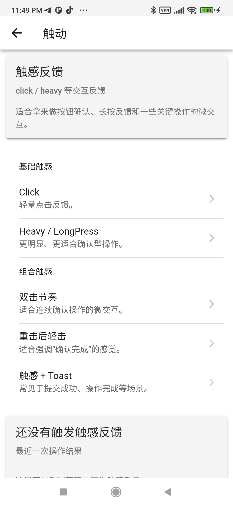
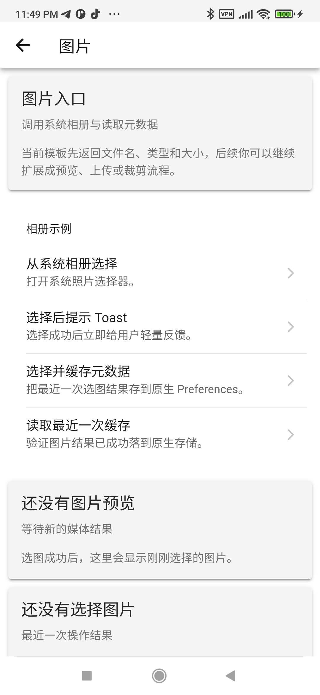

# MAUITemplate

[English](#english) | [中文](#chinese)

---

<a id="english"></a>
## English

**MAUITemplate** is an out-of-the-box **.NET MAUI + Ionic React** Hybrid App development starter template.

This template provides a ready-to-use native shell, a frontend skeleton, and a stable two-way communication bridge between them. This means you can **immediately use familiar React & Web technologies** to build beautiful application UIs, while still being able to easily and safely invoke various native phone capabilities.

---

### 🎨 Why Use This Template?

By combining MAUI and Ionic React, you get a development experience that is "as fast as writing Web" yet "as smooth as native". The fundamental built-in features that have been tested through two-way debugging include, but are not limited to:

- **Theme & UI**: Native-like swipe-to-go-back, click ripples, and smooth responsive Light/Dark mode switching following the system preferences.
- **Device Interactions**: Message prompts (Toast/Snackbar), native vibration feedback (Haptics), and cross-platform notifications.
- **Device Media**: Directly invoke the system photo album, take pictures via the native camera, and the trickiest to handle—**locally pick/record videos with stable Web preview capabilities**.

#### Quick Feature Preview

<div style="display: flex; flex-direction: row; gap: 16px;">
  
  
  
</div>

---

### 🌉 Lightning-fast Two-way Bridge, Just Like Normal APIs

One of the biggest headaches in hybrid architectures is how the **Frontend (JS)** sends data to the **Native end (C#)**, especially when transferring "images" and "binary data".

Here, this issue has been completely solved: we've encapsulated a fully functional, strongly-typed `HybridWebView` bridging mechanism.

- **Fast Single Invocation**: The frontend simply writes `await nativeBridge.getSystemInfo()` to get the system information from the native side. Crossing layers is just like calling a normal function within the same project.
- **Raw Interaction Events**: Need to go lower-level? Send raw messages directly.
- **Long Connections & Continuous Streams**: With a single command from the frontend, C# can continuously push massive text or even **real binary data chunks** for display on the frontend.

#### Bridge Capability Testing

In the template's developer tools, you can visually test all JS and C# communication channels.

<div style="display: flex; flex-direction: row; gap: 16px;">
  
  
</div>

---

### 🚀 How to Run It Quickly?

#### Frontend Development (Ionic React)

All UI-related code resides in `src/MAUITemplate.Web`. You don't need to worry about complex native logic; just open it:

```bash
cd src/MAUITemplate.Web
npm install
npm run build
```

*Note: The built frontend assets will be automatically copied into the MAUI static resource directory as needed.*

#### Native Startup (MAUI)

Open `MAUITemplate.sln` at the project root using Visual Studio, Rider, or VS Code (with the MAUI extension). Select the Android or other target platform and hit Run (F5) to push it to your phone or emulator. Once it starts, it will load the frontend pages you just built!

---

### 🏗️ Tips for Developers (Directory Conventions)

1. **Core Shared**: Place UI-independent definitions, models, and protocols that can be reused across modules in `src/MAUITemplate.Core`.
2. **Native Bridge**: If you need to add a new native capability (e.g., Bluetooth), just add a new method in `AppBridge.Interop.cs` or the same directory. Don't forget to add a brief binding in the frontend's `nativeBridge.ts`.
3. **Frontend Slicing**: When adding a new feature page on the frontend, create a new folder under `src/MAUITemplate.Web/src/features/<feature-name>`.

For more development and architecture discussions, please refer to `docs/architecture.md`.

---

<br/>

<a id="chinese"></a>
## 中文

**MAUITemplate** 是一个开箱即用的 **.NET MAUI + Ionic React** 混合应用（Hybrid App）开发起始模板。

本模板为你搭建好了原生壳子、前端骨架以及它们之间稳定双向的通信桥梁。这意味着你可以**立刻使用熟悉的 React & Web 技术**去编写应用漂亮的界面，同时还能非常轻松、安全地调用各种手机原生能力。

---

### 🎨 为什么使用这个模板？

通过组合 MAUI 与 Ionic React，你可以体会到“写 Web 一样快”，且“像原生一样流畅”的开发体验。模板内置且通过双向联调测试的基础功能包括但不限于：

- **主题与 UI**：像原生一样的侧滑返回、点击水波纹，且亮/暗模式随系统自动平滑切换。
- **设备交互**：消息提示 (Toast/Snackbar)、原生震动反馈 (Haptics)、跨端通知。
- **设备媒体**：直接调用系统相册、调用原生相机拍照，以及最难搞定的——**本地选择/拍摄视频并稳定在 Web 中预览**机制。

#### 功能快速预览

<div style="display: flex; flex-direction: row; gap: 16px;">
  
  
  
</div>

---

### 🌉 极速双向 Bridge，就像调用普通 API

很多混合架构最让人头疼的是 **前端 (JS)** 怎么跟 **原生端 (C#)** 传数据，特别是怎么传“图”和“二进制”。

在这里，这个问题已经被彻底解决：我们封装了一套功能完整且强类型的 `HybridWebView` 桥接机制。

- **快速单次调用**：前端只需写 `await nativeBridge.getSystemInfo()` 就能拿到原生传来的系统信息。跨界就像在一个项目里调用一个普通函数。
- **原始交互事件**：想要更底层？直接发送 raw message。
- **长连接与持续推流**：只需前端发个命令，C# 就可以源源不断地把大量文本甚至**真实的二进制数据块**持续推送并展示在给前端。

#### 桥接能力测试

在模板的开发者工具里，你可以非常直观地测试所有 JS 与 C# 的通信链路。

<div style="display: flex; flex-direction: row; gap: 16px;">
  
  
</div>

---

### 🚀 怎么快速跑起来？

#### 前端开发 (Ionic React)

所有的 UI 相关代码全在 `src/MAUITemplate.Web`，你不需要关心繁杂的原生逻辑，只需要打开它：

```bash
cd src/MAUITemplate.Web
npm install
npm run build
```

*注意：构建完成的前端产物会自动按需复制到 MAUI 的静态资源目录下。*

#### 原生启动 (MAUI)

用 Visual Studio、Rider 或者 VS Code (配合 MAUI 扩展) 打开项目顶层的 `MAUITemplate.sln`，选中 Android 等平台，点击运行（F5），它就能被推送到你的手机或模拟器里。跑起来之后，它就会加载你刚刚构建的前端页面！

---

### 🏗️ 给开发者的建议（目录约定）

1. **核心共享**：把不依赖 UI，可以被跨模块复用的 API、模型、协议放到 `src/MAUITemplate.Core`。
2. **原生桥接**：要是你要增加原生的新能力（比如蓝牙），直接在 `AppBridge.Interop.cs` 或同目录里加个新方法。别忘了在前端 `nativeBridge.ts` 稍微加几行绑定下就行。
3. **前端切片**：前端新增加功能页时，都在 `src/MAUITemplate.Web/src/features/<feature-name>` 下新建文件夹。

更多开发和架构讨论，请参考 `docs/architecture.md`。