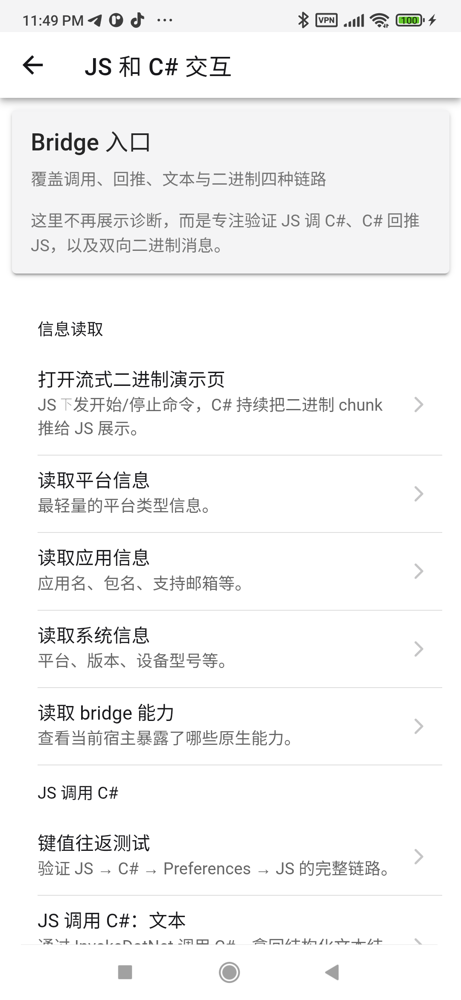
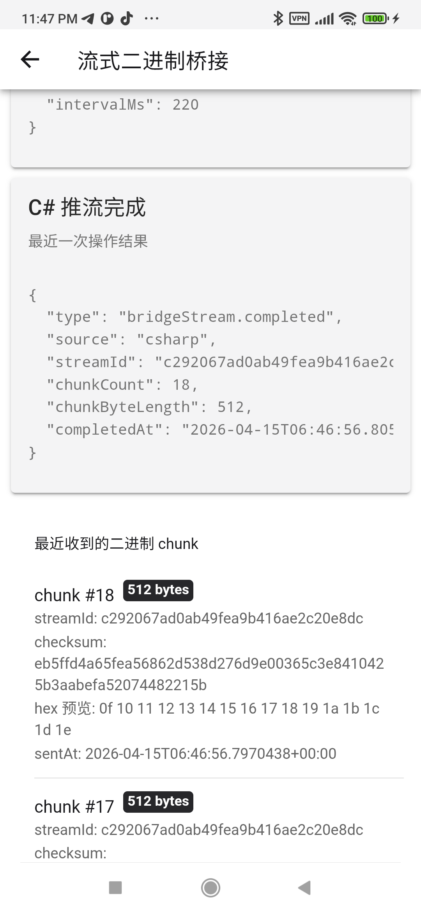

# MAUITemplate

[中文版](README-zh.md)

**MAUITemplate** is an out-of-the-box **.NET MAUI + Ionic React** Hybrid App development starter template.

This template provides a ready-to-use native shell, a frontend skeleton, and a stable two-way communication bridge between them. This means you can **immediately use familiar React & Web technologies** to build beautiful application UIs, while still being able to easily and safely invoke various native phone capabilities.

---

### 🎨 Why Use This Template?

By combining MAUI and Ionic React, you get a development experience that is "as fast as writing Web" yet "as smooth as native". The fundamental built-in features that have been tested through two-way debugging include, but are not limited to:

- **Theme & UI**: Native-like swipe-to-go-back, click ripples, and smooth responsive Light/Dark mode switching following the system preferences.
- **Device Interactions**: Message prompts (Toast/Snackbar), native vibration feedback (Haptics), and cross-platform notifications.
- **Device Media**: Directly invoke the system photo album, take pictures via the native camera, and the trickiest to handle—**locally pick/record videos with stable Web preview capabilities**.

#### Quick Feature Preview

<div style="display: flex; flex-direction: row; gap: 16px;">
  
  
  
</div>

---

### 🌉 Lightning-fast Two-way Bridge, Just Like Normal APIs

One of the biggest headaches in hybrid architectures is how the **Frontend (JS)** sends data to the **Native end (C#)**, especially when transferring "images" and "binary data".

Here, this issue has been completely solved: we've encapsulated a fully functional, strongly-typed `HybridWebView` bridging mechanism.

- **Fast Single Invocation**: The frontend simply writes `await nativeBridge.getSystemInfo()` to get the system information from the native side. Crossing layers is just like calling a normal function within the same project.
- **Raw Interaction Events**: Need to go lower-level? Send raw messages directly.
- **Long Connections & Continuous Streams**: With a single command from the frontend, C# can continuously push massive text or even **real binary data chunks** for display on the frontend.

#### Bridge Capability Testing

In the template's developer tools, you can visually test all JS and C# communication channels.

<div style="display: flex; flex-direction: row; gap: 16px;">
  
  
</div>

---

### 🚀 How to Run It Quickly?

#### Frontend Development (Ionic React)

All UI-related code resides in `src/MAUITemplate.Web`. You don't need to worry about complex native logic; just open it:

```bash
cd src/MAUITemplate.Web
npm install
npm run build
```

_Note: The built frontend assets will be automatically copied into the MAUI static resource directory as needed._

#### Native Startup (MAUI)

Open `MAUITemplate.sln` at the project root using Visual Studio, Rider, or VS Code (with the MAUI extension). Select the Android or other target platform and hit Run (F5) to push it to your phone or emulator. Once it starts, it will load the frontend pages you just built!

---

### 🏗️ Tips for Developers (Directory Conventions)

1. **Core Shared**: Place UI-independent definitions, models, and protocols that can be reused across modules in `src/MAUITemplate.Core`.
2. **Native Bridge**: If you need to add a new native capability (e.g., Bluetooth), just add a new method in `AppBridge.Interop.cs` or the same directory. Don't forget to add a brief binding in the frontend's `nativeBridge.ts`.
3. **Frontend Slicing**: When adding a new feature page on the frontend, create a new folder under `src/MAUITemplate.Web/src/features/<feature-name>`.
